# Praktikum 1 : Membuat Project Flutter Baru

# Langkah  1

Buka VS Code, lalu tekan tombol Ctrl + Shift + P maka akan tampil Command Palette, lalu ketik Flutter. Pilih New Application Project. 

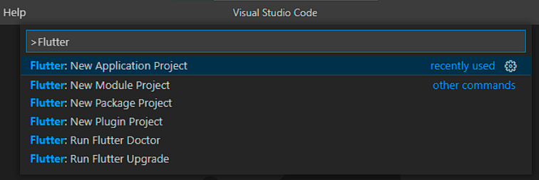

# Langkah 3

Buat nama project flutter hello_world seperti berikut, lalu tekan Enter. Tunggu hingga proses pembuatan project baru selesai.

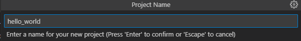

# Langkah 4

Jika sudah selesai proses pembuatan project baru, pastikan tampilan seperti berikut. Pesan akan tampil berupa "Your Flutter Project is ready!" artinya Anda telah berhasil membuat project Flutter baru.

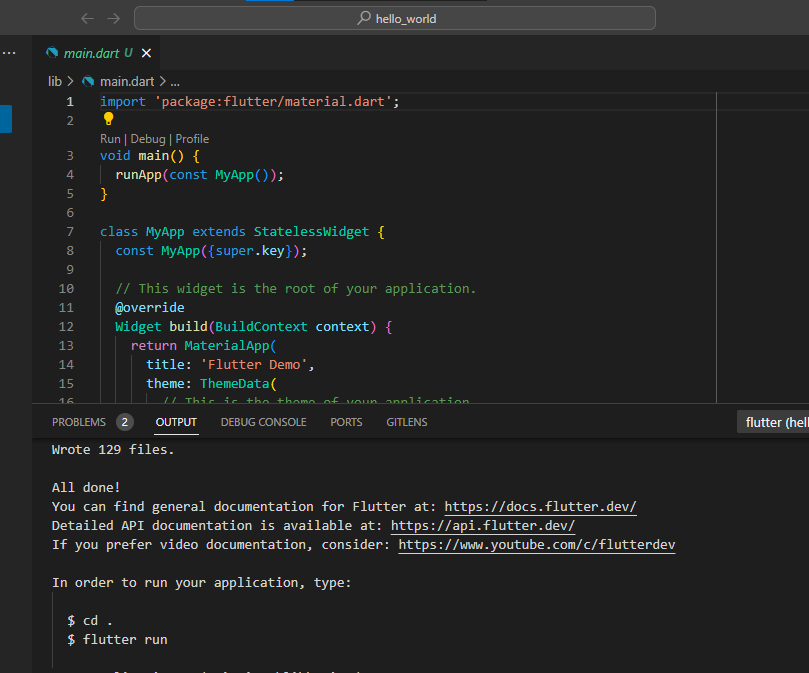

# Praktikum 2: Membuat Repository GitHub dan Laporan Praktikum

# Langkah 4 :

Pilih menu Source Control di bagian kiri, lalu lakukan stages (+) pada file .gitignore untuk mengunggah file pertama ke repository GitHub.

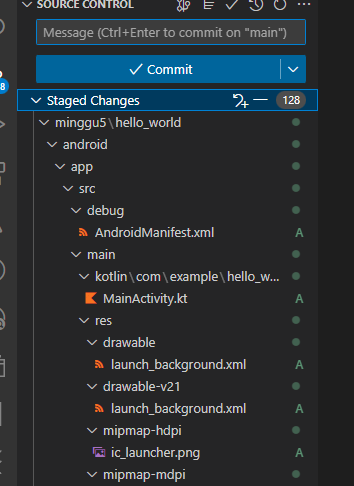

# Langkah 5 :

Beri pesan commit "tambah gitignore" lalu klik Commit (✔)

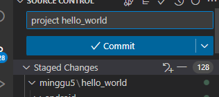

# Langkah 6 :

Lakukan push dengan klik bagian menu titik tiga > Push

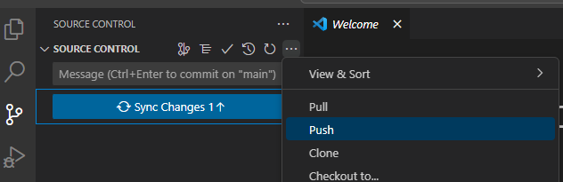
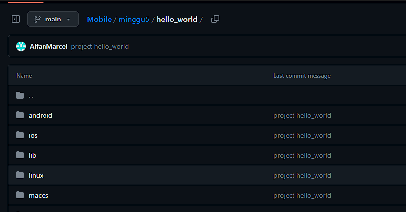

# Langkah 11 :

Kembali ke VS Code, ubah platform di pojok kanan bawah ke emulator atau device atau bisa juga menggunakan browser Chrome. Lalu coba running project hello_world dengan tekan F5 atau Run > Start Debugging. Tunggu proses kompilasi hingga selesai, maka aplikasi flutter pertama Anda akan tampil seperti berikut.

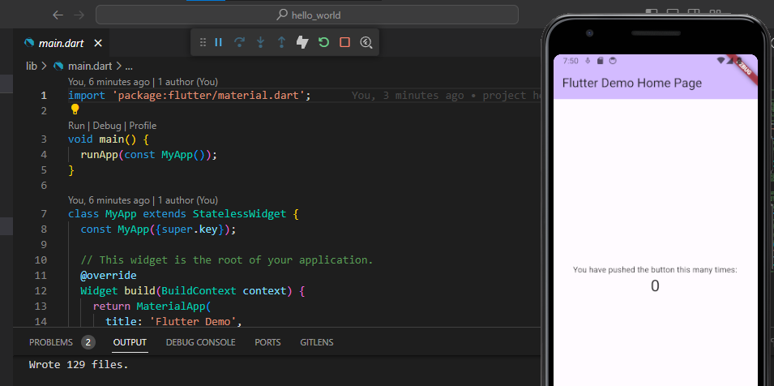

# Langkah 12 :

Silakan screenshot seperti pada Langkah 11, namun teks yang ditampilkan dalam aplikasi berupa nama lengkap Anda. Simpan file screenshot pada folder images (buat folder baru jika belum ada) di project hello_world Anda. Lalu ubah isi README.md seperti berikut, sehingga tampil hasil screenshot pada file README.md. Kemudian push ke repository Anda.

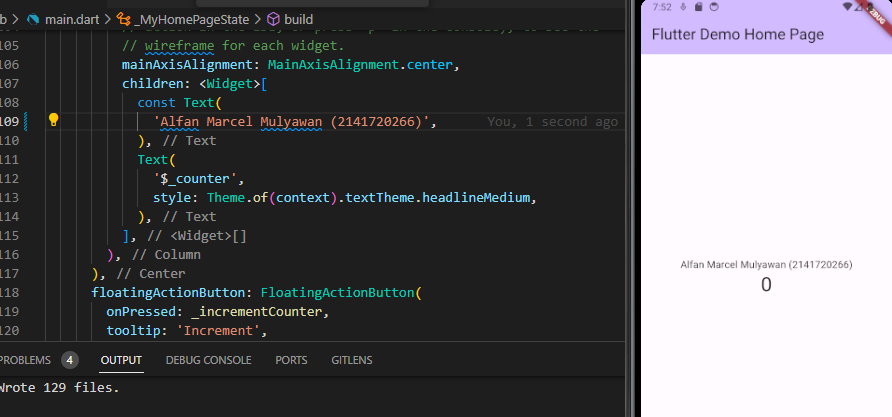

# Praktikum 3: Menerapkan Widget Dasar

# Langkah 1 : Text Widget

Buat folder baru basic_widgets di dalam folder lib. Kemudian buat file baru di dalam basic_widgets dengan nama text_widget.dart. Ketik atau salin kode program berikut ke project hello_world Anda pada file    text_widget.dart.

        import 'package:flutter/material.dart';

        class MyTextWidget extends StatelessWidget {
            const MyTextWidget({Key? key}) : super(key: key);

            @override
            Widget build(BuildContext context) {
                return const Text(
                "Nama saya Fulan, sedang belajar Pemrograman Mobile",
                style: TextStyle(color: Colors.red, fontSize: 14),
                textAlign: TextAlign.center);
            } 
        }       

Lakukan import file text_widget.dart ke main.dart, lalu ganti bagian text widget dengan kode di atas. Maka hasilnya seperti gambar berikut. Screenshot hasil milik Anda, lalu dibuat laporan pada file README.md.

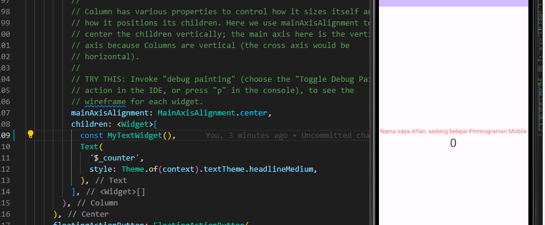

# Langkah 2 : Image Widget

Buat sebuah file    image_widget.dart di dalam folder basic_widgets dengan isi kode berikut.

        import 'package:flutter/material.dart';

        class MyImageWidget extends StatelessWidget {
            const MyImageWidget({Key? key}) : super(key: key);

            @override
            Widget build(BuildContext context) {
                return const Image(
                    image: AssetImage("logo_polinema.png")
                );
            }
        }

Lakukan penyesuaian asset pada file pubspec.yaml dan tambahkan file logo Anda di folder     assets project hello_world.

        flutter:
            assets:
                - assets/logo_polinema.png

Jangan lupa sesuaikan kode dan import di file main.dart kemudian akan tampil gambar seperti berikut.

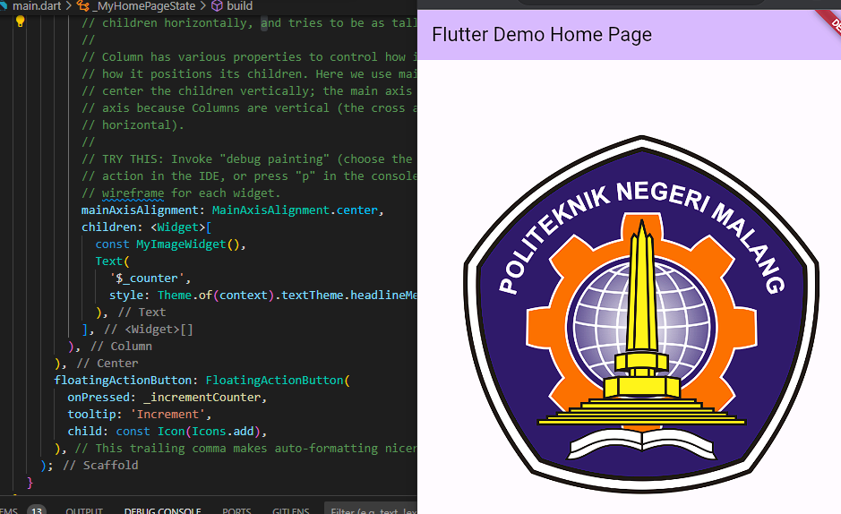