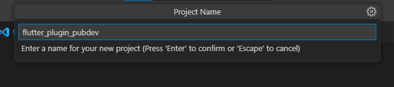
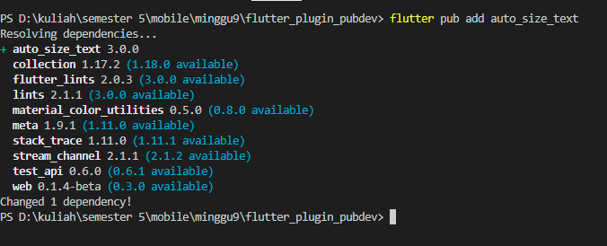
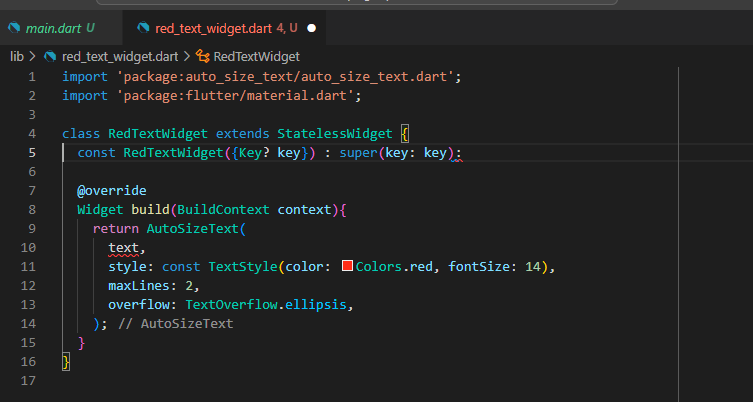
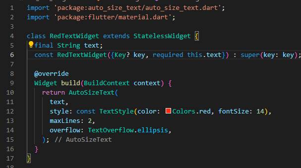
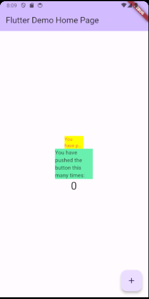

# Praktikum Menerapkan Plugin di Project Flutter

# Langkah 1: Buat Project Baru
Buatlah sebuah project flutter baru dengan nama flutter_plugin_pubdev. Lalu jadikan repository di GitHub Anda dengan nama flutter_plugin_pubdev.

# Langkah 2: Menambahkan Plugin
Tambahkan plugin auto_size_text menggunakan perintah berikut di terminal

Proses menambahkan plugin auto_sized_text yang digunakan untuk mengubah ukuran teks yang berada didalamnya sehingga sesuai dengan batasannya.  

# Langkah 3: Buat file red_text_widget.dart
Buat file baru bernama red_text_widget.dart di dalam folder lib lalu isi kode seperti berikut.

    import 'package:flutter/material.dart';

    class RedTextWidget extends StatelessWidget {
    const RedTextWidget({Key? key}) : super(key: key);

    @override
    Widget build(BuildContext context) {
        return Container();
    }
    }

# Langkah 4: Tambah Widget AutoSizeText
Masih di file red_text_widget.dart, untuk menggunakan plugin auto_size_text, ubahlah kode return Container() menjadi seperti berikut.

terdapat error karena variable dan parameter untuk plugin belum didefinisikan

# Langkah 5: Buat Variabel text dan parameter di constructor
Tambahkan variabel text dan parameter di constructor seperti berikut.

menambahkan varibel text dan juga parameter yang akan digunakan pada plugin auto_sized_text ketika dipanggil

# Langkah 6: Tambahkan widget di main.dart
Buka file main.dart lalu tambahkan di dalam children: pada class _MyHomePageState

    Container(
    color: Colors.yellowAccent,
    width: 50,
    child: const RedTextWidget(
                text: 'You have pushed the button this many times:',
            ),
    ),
    Container(
        color: Colors.greenAccent,
        width: 100,
        child: const Text(
            'You have pushed the button this many times:',
            ),
    ),

- widget yang pertama menggunakan widget auto_sized_text sehingga inputan parameter yang dimasukkan akan automatis dirubah untuk warna menjadi merah, ukuran font 14 dan maxLine yang ditampilkan 2, dan menampilkan ... untuk sisa kalimat dengan menggunakan TextOverflow.ellipsis
- widget yang kedua tidak menggunakan widget auto_sized_text sehingga hanya menampilkan tulisan hitam dan seluruh kalimat tanpa adanya perubahan

# Jelaskan maksud dari tiap parameter yang ada di dalam plugin auto_size_text berdasarkan tautan pada dokumentasi
| Parameter | Description |
| ----------- | :---------: |
| key* | Key adalah kunci yang digunakan untuk mengidentifikasi widget ini. Biasanya digunakan untuk keperluan tes atau pengujian.|
| textKey | Key khusus untuk teks yang akan diubah ukurannya. Ini digunakan untuk mengidentifikasi teks yang akan diatur ukurannya|
| style* | Menentukan gaya teks seperti warna, ukuran, tebal, dll.|
| minFontSize | Ukuran font minimum yang diizinkan ketika teks disesuaikan. Ini menentukan ukuran terkecil yang teks bisa memiliki|
| maxFontSize| Ukuran font maksimum yang diizinkan ketika teks disesuaikan. Ini menentukan ukuran terbesar yang teks bisa memiliki|
| stepGranularity | Menentukan seberapa besar peningkatan atau pengurangan ukuran font harus dilakukan saat menyesuaikan teks |
| presetFontSizes | Daftar ukuran font yang tersedia untuk digunakan saat menyesuaikan teks. Widget akan memilih dari daftar ini berdasarkan kebutuhan|
| group |  String yang digunakan untuk mengelompokkan beberapa widget auto_size_text bersama-sama. Ini digunakan jika ingin mengontrol ukuran font yang sama untuk beberapa teks yang berbeda |
| textAlign* | Menentukan posisi teks dalam widget, apakah di tengah, di kiri, di kanan, atau lainnya. |
| textDirection* |  Menentukan arah teks, apakah dari kiri ke kanan atau sebaliknya |
| locale* | Menentukan bahasa dan budaya untuk menentukan cara teks ditampilkan. |
| softWrap* | Menentukan apakah teks dapat mematahkan baris jika melebihi lebar widget |
| wrapWords | Menentukan apakah kata-kata dalam teks akan dibungkus saat mencapai batas lebar widget atau hanya pada spasi. |
| overflow* | Menentukan tindakan yang akan diambil jika teks melebihi lebar widget. Misalnya, apakah akan dipotong atau diakhiri dengan elipsis |
| overflowReplacement | Teks pengganti yang akan ditampilkan jika teks melebihi lebar widget dan parameter overflow diatur untuk melakukan potongan atau elipsis|
| textScaleFactor* |  Faktor skala yang digunakan untuk mengubah ukuran font teks. Ini adalah cara alternatif untuk mengatur ukuran font teks. |
| maxLines | Batasan jumlah baris yang akan ditampilkan. Jika teks melebihi jumlah baris ini, perilaku overflow akan diterapkan. |
| semanticsLabel* | Deskripsi: Label yang digunakan untuk aksesibilitas, membantu pembaca layar dalam menjelaskan teks kepada pengguna |
